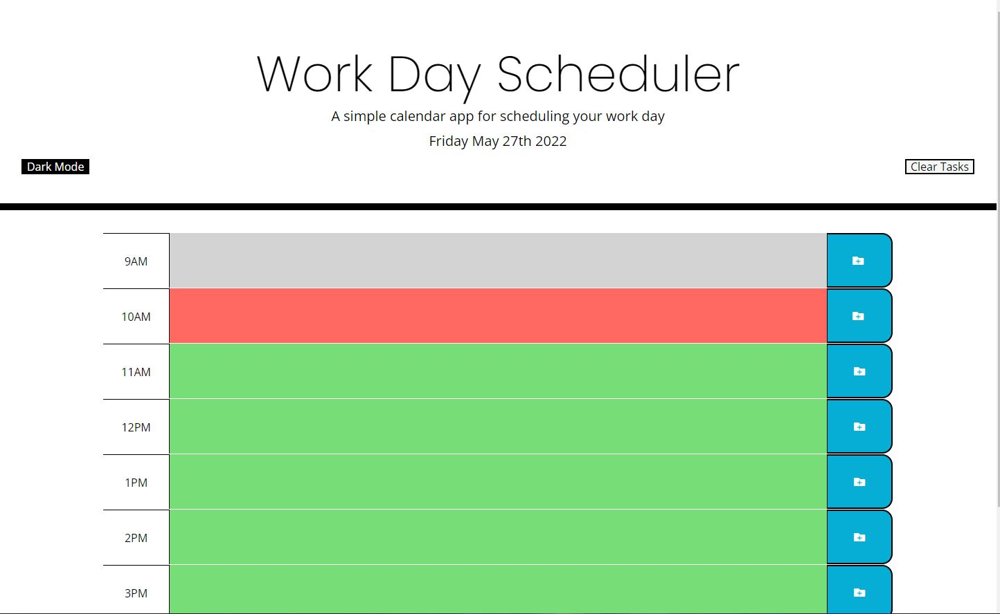
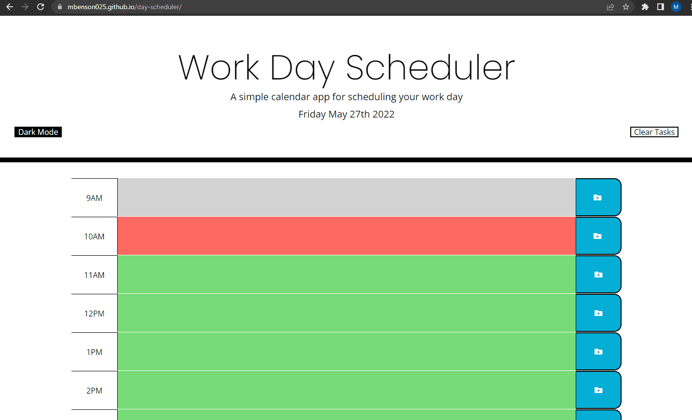

<h1> Day Scheduler </h1>

## Link:

<h2><a href="https://mbenson025.github.io/day-scheduler/">Day Scheduler</a></h2>

 

## About

This application is designed to resemble a typical work day in which the user is able to plan and schedule activities. Each row represents an hour from 9am to 5pm and is accompanied by a save button that uses localStorage to maintain the user's notes.

 

## Technologies used:

Moment.js and jQuery. Languages used: HTML5, CSS, JavaScript

 

## Instructions:

 

Download/clone repository or click link above

 

- Type entries for daily activities in time slots accordingly
- Click the save icon on the right of each row to save your schedule
- Clear button erases all entries
- Dark mode switches to alternate color scheme

 

## Screenshot of deployed app:

 

 
 
 

## Live Demo:

 

 
 
 

## Contact:

 

Mason Benson - mbenson025@gmail.com

GitHub Profile - https://github.com/mbenson025

 

## License:

 

MIT License

Copyright (c) 2022 Mason Benson

Licensed under the [MIT](LICENSE) license.
